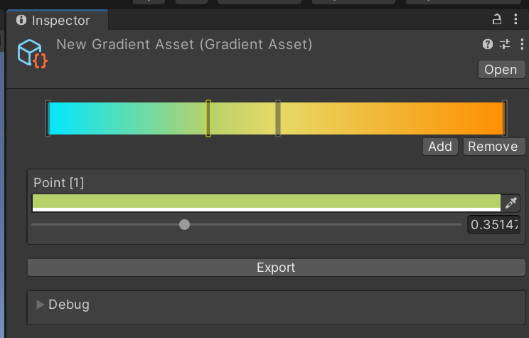

# Gradients
 
## Dependencies:
- https://github.com/Toorah/com.toorah-games.drawing

## How to Use
- ***right-click*** in your **Project Window** and select:
> ***Gradient**/Create Gradient*

> **Inspector**
>

- Click on **Add/+** to add new *Color Keys*
- Click on a *Color Key* to select it
- Use the *Color Field* and *Slider* to edit the Key's Data ***OR*** drag the key directly to position it
- Click on **Remove/-** to remove the selected Key
- Click **Export** to generate and save a *PNG* in the project
- **Debug**: Preview the gradient  

## Known Issues
- Sometimes when adding new *Color Keys*, the preview texture disappears
- **Undo** is not yet supported
